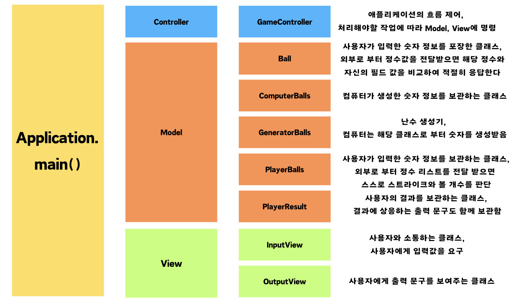
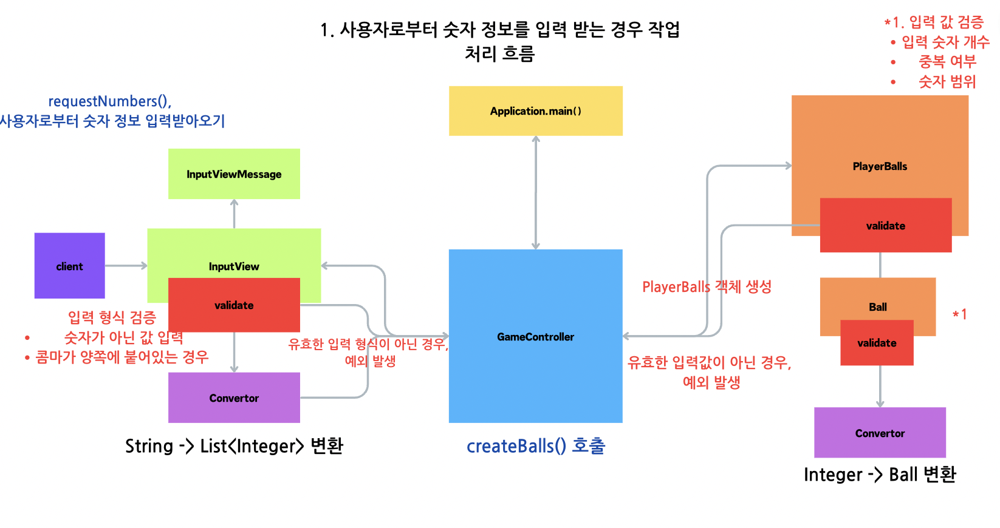

## 📢 프로젝트 소개 목차
1. [프로젝트 한줄 요약](#-프로젝트-한줄-요약)
2. [프로젝트 구조도](#-프로젝트-구조도)
3. [프로젝트 클래스 기능](#-프로젝트-클래스-기능)
4. [프로젝트 작동 흐름](#-프로젝트-작동-흐름)
5. [테스트케이스 결과](#-테스트-케이스-진행-결과)
6. [기능 요구 사항 요약](#-기능-요구-사항-요약)
7. [기능 목록 개발 과정](#-기능-목록-작성)

 
 

### 📌 프로젝트 한줄 요약

📱<b> 컴퓨터가 1~9까지 서로 다른 임의의 수 3개를 선정하면 사용자는 이를 맞춰야 한다 </b>

 
 

### 📌 프로젝트 구조도

- <b>MVC 패턴을 중점으로 주요 클래스만 표시</b>, 그 외 클래스는 주요 클래스를 서포트 하는 클래스이므로 생략

 
 

### 📌 프로젝트 클래스 기능

<table>
    <tr>
        <th text-align="center">Package</th>
        <th text-align="center">Class</th>
        <th text-align="center">Description</th>
    </tr>
    <tr>
        <td rowspan="5"><b>constant</b></td>
        <tr>
            <td><b>BallConstant</b></td>
            <td>Enum 클래스, Ball 클래스에서 사용하는 상수 보관 및 관리</td>
        </tr>
        <tr>
            <td><b>ComputerBallsConstant</b></td>
            <td>Enum 클래스, ComputerBalls 클래스에서 사용하는 상수 보관 및 관리</td>
        </tr>
        <tr>
            <td><b>GeneratorBallsConstant</b></td>
            <td>Enum 클래스, GeneratorBalls 클래스에서 사용하는 상수 보관 및 관리</td>
        </tr>
        <tr>
            <td><b>PlayerBallsConstant</b></td>
            <td>Enum 클래스, PlayerBalls 클래스에서 사용하는 상수 보관 및 관리</td>
        </tr>
        </td>
    </tr>
    <tr><td colspan="3"></td></tr>
    <tr>
        <td rowspan="2"><b>controller</b></td>
        <tr>
            <td><b>GameController</b></td>
            <td>전체 게임 흐름을 제어, 게임을 진행하기 위해 필요한 작업들을 Model, View 객체에 명령을 내려서 처리함</td>
        </tr>
        </td>
    </tr>
    <tr><td colspan="3"></td></tr>
    <tr>
        <td rowspan="6"><b>exception</b></td>
        <tr>
            <td><b>BallExceptionMessage</b></td>
            <td>Enum 클래스, Ball 클래스에서 발생하는 예외 문구 보관 및 관리</td>
        </tr>
        <tr>
            <td><b>ComputerBallsExceptionMessage</b></td>
            <td>Enum 클래스, ComputerBalls 클래스에서 발생하는 예외 문구 보관 및 관리</td>
        </tr>
        <tr>
            <td><b>ConvertorExceptionMessage</b></td>
            <td>Enum 클래스, Convertor 클래스에서 발생하는 예외 문구 보관 및 관리</td>
        </tr>
        <tr>
            <td><b>InputViewExceptionMessage</b></td>
            <td>Enum 클래스, InputView 클래스에서 발생하는 예외 문구 보관 및 관리</td>
        </tr>
        <tr>
            <td><b>PlayerBallsExceptionMessage</b></td>
            <td>Enum 클래스, PlayerBalls 클래스에서 발생하는 예외 문구 보관 및 관리</td>
        </tr>
        </td>
    </tr>
    <tr><td colspan="3"></td></tr>
    <tr>
        <td rowspan="6"><b>model</b></td>
        <tr>
            <td><b>Ball</b></td>
            <td>사용자가 입력한 숫자 정보를 포장한 객체, 외부로부터 정수값을 전달받으면 자신의 필드값과 비교하여 같은 숫자인지 아닌지 응답함</td>
        </tr>
        <tr>
            <td><b>ComputerBalls</b></td>
            <td>컴퓨터가 생성한 숫자 정보를 보관하는 클래스로, 게터를 통해서 해당 필드값을 조회할 수 있게 만듦</td>
        </tr>
        <tr>
            <td><b>GeneratorBalls</b></td>
            <td>1~9까지 서로다른 임의의 숫자를 3개 생성하는 클래스, ComputerBalls 필드값 생성</td>
        </tr>
        <tr>
            <td><b>PlayerBalls</b></td>
            <td>사용자가 입력한 숫자정보를 보관하고, 외부로부터 숫자 리스트 정보를 받으면 해당 리스트와 내부 필드값을 비교하여 스스로 스트라이크, 볼 개수를 계산하여 응답함</td>
        </tr>
        <tr>
            <td><b>PlayerResult</b></td>
            <td>Enum 클래스로, 결과로 생성될 수 있는 것들을 모두 병렬형태로 처리, 또한 그에 상응하는 출력 문구도 보관함</td>
        </tr>
        </td>
    </tr>
    <tr><td colspan="3"></td></tr>
    <tr>
        <td rowspan="6"><b>util</b></td>
        <tr>
            <td><b>CharacterUtil</b></td>
            <td>Enum 클래스, 해당 프로젝트 내에서 활용되는 유닛을 보관함</td>
        </tr>
        <tr>
            <td><b>Convertor</b></td>
            <td>사용자로부터 입력받은 값을 적절히 변환해주거나, 특정 클래스에서 값을 변환할 때 사용하는 클래스</td>
        </tr>
        <tr>
            <td><b>Generator</b></td>
            <td>난수 생생하는 클래스의 상위 인터페이스</td>
        </tr>
        <tr>
            <td><b>GeneratorImp</b></td>
            <td>Generator의 구현체로, 해당 프로젝트에서 난수를 생성할 때 실질적으로 사용하는 구현체임</td>
        </tr>
        <tr>
            <td><b>MessageFormat</b></td>
            <td>Enum 클래스, 프로젝트 내에서 반복적으로 활용되는 문구 패턴을 묶어서 보관 및 관리</td>
        </tr>
        </td>
    </tr>
    <tr><td colspan="3"></td></tr>
    <tr>
        <td rowspan="10"><b>view</b></td>
        <tr>
            <td><b>InputViewMessage</b></td>
            <td>Enum 클래스, InputView에서 활용하는 출력 메시지를 보관 및 관리</td>
        </tr>
        <tr>
            <td><b>OutputViewMessage</b></td>
            <td>Enum 클래스, OutputView에서 활용하는 출력 메시지를 보관 및 관리</td>
        </tr>
        <tr>
            <td><b>InputView</b></td>
            <td>사용자와 소통하여 입력값을 요구하고 받아오는 클래스</td>
        </tr>
        <tr>
            <td><b>OutputView</b></td>
            <td>사용자와 소통하여 출력값을 보여주는 클래스</td>
        </tr>
        </td>
    </tr>
    <tr>
</table>

 

 
 

### 📌 프로젝트 작동 흐름

#### 1. 사용자로부터 숫자를 입력 받는 경우

 
 

#### 2. 내부적으로 스트라이크와 볼을 계산하는 기능

 
 

#### 3. 사용자로부터 재시작 요청을 받는 경우

 
 

#### 4. 사용자로부터 종료 요청을 받는 경우

 
 

#### 5. 전체 프로젝트 작동 흐름

 
 

### 📌 테스트 케이스 진행 결과

최종 구현 완료 후 테스트 케이스 진행 흐름 그림 첨부

 
 

### 📌 기능 요구 사항 요약

~~~
- 1~9 서로 다른 수로 이루어진 3개의 수를 맞추는 게임
  - 같은 수 같은 자리 : 스트라이크
  - 같은 수 다른 자리 : 볼
  - 낫싱

- 컴퓨터는 서로 다른 3개의 숫자 임의로 선택
- 플레이어는 서로 다른 3개의 숫자 입력

- 3개의 숫자를 모두 맞히면 게임 종료
  - 종료한 후 게임을 다시 시작하거나 완전히 종료 가능

  
- 잘못된 값을 입력할 경우 IllegalArgumentException 을 발생 후 애플리케이션 종료
~~~
 
 

### 📌 기능 목록 작성

#### 1. 입/출력

[✅] 사용자가 선택한 숫자 입력 받기
- 예외 처리 : 숫자가 아닌 값, 잘못된 입력 형식 -> IllegalArgumentException

[✅] 게임 재시작 여부 입력 받기
- 예외 처리 : 1~2 이외의 값, 잘못된 입력 형식 -> IllegalArgumentException

[✅] 입력에 대한 결과 출력

#### 2. 기능
[✅] 컴퓨터가 1~9까지 서로 다른 임의의 수 선정 
- 예외 처리 : 숫자 3개 입력 x, 1~9 이외의 숫자 -> IllegalArgumentException

[✅] 사용자가 입력한 값과 컴퓨터가 선정한 값 비교
- 예외 처리 : 숫자 3개 입력 x, 1~9 이외의 숫자 -> IllegalArgumentException

[✅] 1~9까지 임의의 숫자 3개 생성, 중복 제거

[✅] 게임 재시작 기능
